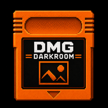

# MugDump

**Dump and develop your Game Boy Camera mug shots.** Point MugDump at a Game Boy
Camera save — straight off your Analogue Pocket SD card, or any `.sav` / `.srm`
dump — and it pulls out your 30 photos, gives them a full digital darkroom
(palettes, effects, frames), and exports them as PNG or animated GIF.

Runs two ways from the same code: a desktop **Electron app**, and a zero-install
**web app** that runs entirely in your browser.

> *mug shot* (the portraits the Game Boy Camera was made for) + *memory dump*
> (pulling the photos out of the cartridge SRAM) = **MugDump**.

---

## What it does

**Read your saves**
- Loads Game Boy Camera SRAM dumps (`.sav` / `.srm`, 128 KB) — drag-and-drop or file picker
- **Analogue Pocket** SD-card detection: finds Game Boy Camera saves under
  `Memories/` (built-in cores) and `Saves/` (openFPGA cores) automatically
- Decodes the 2bpp tile format into your 30 photo slots, skipping empty ones

**Develop them**
- **100+ palettes** — original DMG/GBC/SGB hardware palettes plus Lospec community palettes
- Custom **palette editor** with `.pal` / `.gbp` import & export, favourites and a random picker
- A deep stack of **effects**: CRT scanlines, LCD grid, halftone, dot-matrix,
  phosphor glow, chromatic aberration, vignette, noise, VHS ghosting, dithering,
  pixel-sort, glitch — each with its own controls
- Tone controls: brightness, contrast, split toning
- **21 authentic Game Boy Camera border frames**, recoloured to match your palette
- Apply everything per-photo or globally across the whole roll; copy/paste settings; undo

**Export them**
- Batch **PNG** at any scale, with palette and effects baked in
- Animated **GIF** builder — reorder frames, per-frame palettes, loop / bounce
- **Contact sheet** of all 30 photos in one image
- Save and reload your work as a `.gbcp` project file

---

## Running it

### Web app
Open `docs/index.html` in a browser, or serve the `docs/` folder. Chrome / Edge
give the best experience (File System Access API for direct SD-card reading);
Firefox and Safari fall back to standard file pickers. No install, no sign-up.

### Desktop app (Electron)
```bash
npm install
npm start
```
Build installers (output in `dist/`):
```bash
npm run build:win     # Windows (NSIS)
npm run build:mac     # macOS (dmg)
npm run build:linux   # Linux (AppImage)
```

---

## How it works

Game Boy Camera SRAM is exactly 128 KB. Photo data starts at offset `0x2000`,
in 30 slots of `0x1000` bytes each. Every slot holds a 128×112 image stored as
2-bits-per-pixel Game Boy tiles (16×14 tiles, 16 bytes per tile), plus a
thumbnail and metadata. Each pixel is a value 0–3 that MugDump maps onto the
four colours of your chosen palette. `.srm` files are the same SRAM in
RetroArch's naming — identical structure to `.sav`.

The decoding lives in [`renderer/js/gbcam.js`](renderer/js/gbcam.js); the whole
editor/UI is in [`renderer/js/app.js`](renderer/js/app.js). The desktop shell
([`main.js`](main.js)) and the browser shim
([`docs/js/web-api.js`](docs/js/web-api.js)) expose the same `window.api`, so the
app code is identical across both targets.

---

<sub>A fork of [DMG DarkRoom](https://github.com/clickysteve/dmg-darkroom) by clickysteve. SRAM format research: [AntonioND/gbcam2png](https://github.com/AntonioND/gbcam2png) & the [Game Boy Camera Club](https://gameboycameraclub.com). Palettes: [The Cutting Room Floor](https://tcrf.net/Notes:Game_Boy_Color_Bootstrap_ROM) and [Lospec](https://lospec.com). Border frames: [RomanObaraz/gb-cam-lab](https://github.com/RomanObaraz/gb-cam-lab).</sub>
